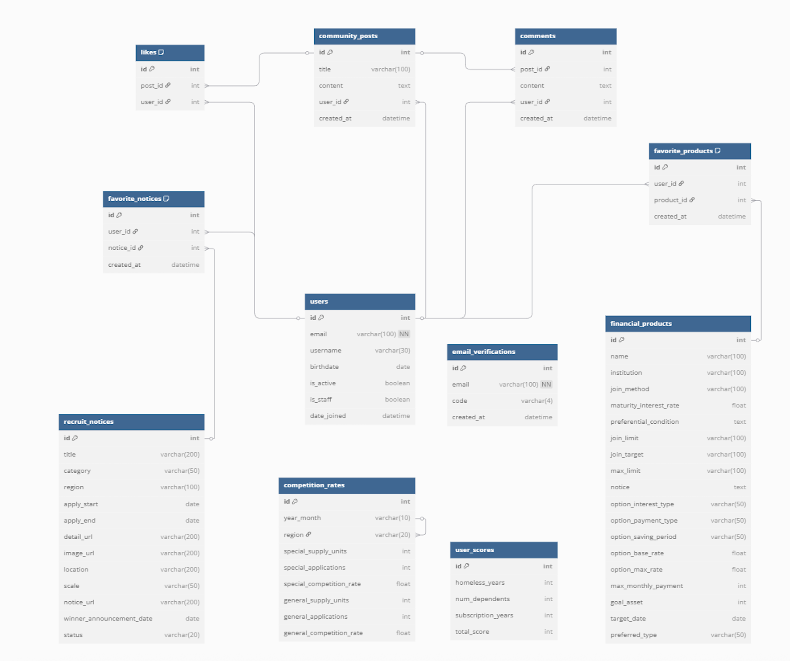

# 🏠 HOUSCAN

## SSAFY 1학기 관통 프로젝트 **최우수상**
 
**청약부터 예적금, 커뮤니티까지 한 번에!**

## 1-1. 프로젝트 소개

- **프로젝트명**: HOUSCAN (HOUSE + SCAN의 합성어)
- **기간**: 2025.05.21 ~ 2025.05.28
- **팀장**: 신재은 (프론트엔드)
- **팀원**: 박수정 (백엔드)

> "HOUSCAN은 사용자의 자산 준비 과정을 처음부터 끝까지 스캔해주는 통합 금융·주거 정보 플랫폼입니다."

## 1-2. 시현 영상 

---

## 2. 주제 선정 배경

### ✅ 기존 문제 (AS-IS)
- 청약 공고의 **필터링 기능 부재**s
- 공고문과 **결과 발표 구분 어려움**
- 예적금, 청약, 커뮤니티 기능이 각각 **단절**

### 🚀 개선 방향 (TO-BE)
- 공고문 필터링 + 진행 상태별 구분 제공
- **예적금 상품** 추천 기능으로 목돈 마련 지원
- **가점 계산기** + AI 기반 전략 제안 기능
- **찜한 예적금/공고** 통합 관리 가능
- 사용자 경험 공유를 위한 **커뮤니티 기능** 제공

---

## 3. 데이터 수집

- **청약 공고**
  - 크롤링: 공공데이터포털, 분양24
- **금융 상품**
  - API: 금융감독원 오픈 API
- **지도/위치**
  - API: 카카오맵 API
- **AI 분석**
  - OpenAI GPT-4o-mini API 사용

---

## 4. ERD (Entity-Relationship Diagram)

> 

- 주요 테이블:
  - `User`, `UserScore`, `FinancialProduct`, `SubscriptionNotice`, `FavoriteProduct`, `FavoriteNotice`, `CommunityPost`, `Comment`, `CompetitionRate`

---

## 5. 기술 스택

- **Backend**: Django + Django REST framework (DRF)
- **Frontend**: Vue 3 (Composition API) + Pinia + JavaScript
- **Styling**: Bootstrap 5, CSS
- **Database**: SQLite3 (개발 환경), Django ORM
- **외부 API 활용**:
  - 금융감독원 Open API (예·적금 정보)
  - Kakao Map API (지도/지점 위치)
  - OpenAI GPT-4o-mini API (청약 전략 생성)
- **기타**:
  - RESTful API 설계 및 JWT 인증
  - Git 기반 브랜치 협업
  - Axios로 백엔드 통신

---

## 6. 주요 기능

### 🔐 회원정보 관리
- 회원가입 / 로그인 / 비밀번호 찾기 / 회원정보 수정 / 탈퇴
- 로그인 유저만 가능한 찜, 글쓰기, 좋아요, 댓글 기능 제공

### 💰 자산 준비
- 예적금 상품 리스트 + 상세페이지 (지도 포함)
- 목표 자산 기반 예적금 필터링 + 추천
- 찜하기 기능 + 마이페이지 연동
- 가점 계산기 + GPT 기반 전략 제안

### 📢 청약 공고
- 진행 중인 청약 공고 필터링 및 리스트 출력
- 상세 페이지에 위치 지도 포함
- 청약 경쟁률 시각화 (Chart.js)
- D-Day 기반 마감 임박 공고 강조 표시
- 공고 찜하기 기능

### 🗣 커뮤니티
- 인기글 TOP 5 노출
- 게시글: 작성, 수정, 삭제, 좋아요
- 댓글: 작성, 삭제 (작성자만 가능)
- 찜한 예적금·공고와 연동되어 청약 준비 팁 공유 가능

---

## 7. 개발 기록 및 협업 방식

- GitHub를 통한 협업
- 기능 단위로 업무 분리: 프론트/백엔드 분업 + API 연동
- 기능 구현 후 상호 리뷰 및 통합 테스트 진행

---

## 8. 향후 개선 방향

- 카카오맵 기반 최적 병원/청약지 추천 기능 강화
- 사용자 기반 커뮤니티 추천 알고리즘 고도화
- 실시간 크롤링으로 청약 공고 리스트 업데이트

---

> "단순한 정보 제공을 넘어, 실제 자산 준비를 **계획하고 실천할 수 있는 통합 플랫폼**으로 진화하고자 합니다."
